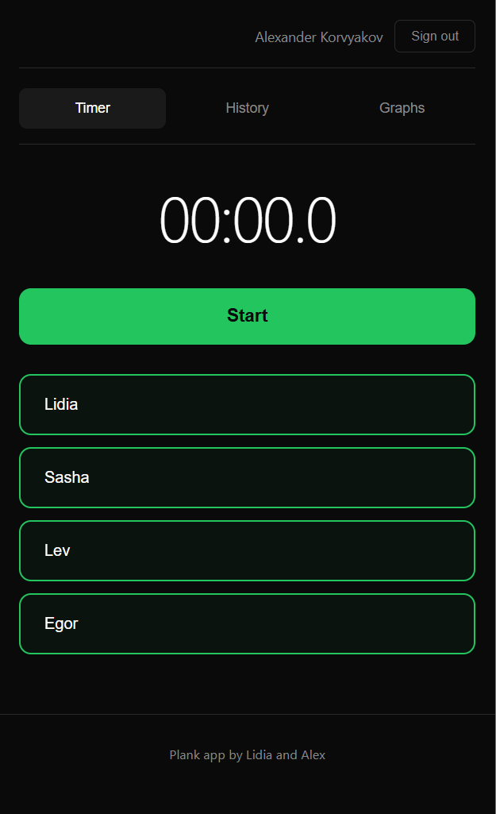

# Plank Timer

A family exercise tracking app for timing plank exercises. Track multiple participants, view history on a calendar, and monitor progress with charts.



## Features

- **Multi-participant timer** - Start a shared timer and tap each person when they finish
- **Calendar history** - View past sessions organized by date
- **Progress graphs** - Track improvement over time for each participant
- **Cloud sync** - Data stored in Firebase, accessible from any device
- **Google sign-in** - Secure authentication

## Setup

### 1. Create a Firebase Project

1. Go to [Firebase Console](https://console.firebase.google.com)
2. Create a new project
3. Enable **Authentication** → Google sign-in
4. Enable **Firestore Database**
5. Add a web app and copy the config

### 2. Configure the App

```bash
cp firebase-config.example.js firebase-config.js
```

Edit `firebase-config.js` and fill in your Firebase credentials.

### 3. Configure Participants

Participants are stored in Firestore. On first run, defaults from `config.js` are used. To change participants:

1. Go to Firebase Console → Firestore
2. Navigate to `config/participants`
3. Edit the `names` array

### 4. Run Locally

```bash
npx firebase-tools serve
```

### 5. Deploy

```bash
npx firebase-tools deploy
```

## Tech Stack

- Vanilla JavaScript (no framework)
- Firebase Authentication & Firestore
- Chart.js for graphs

---

Built with [Claude Code](https://claude.ai/claude-code) - ask Claude Code to help you customize or extend this app!
